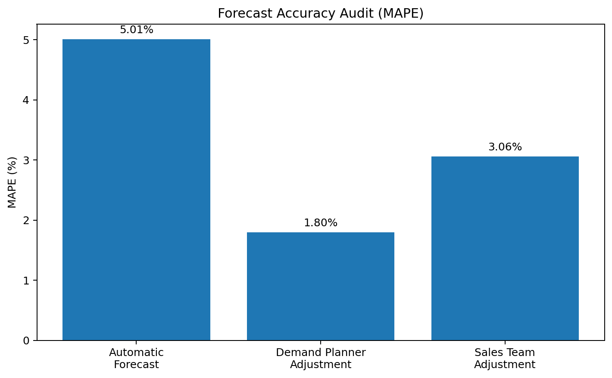
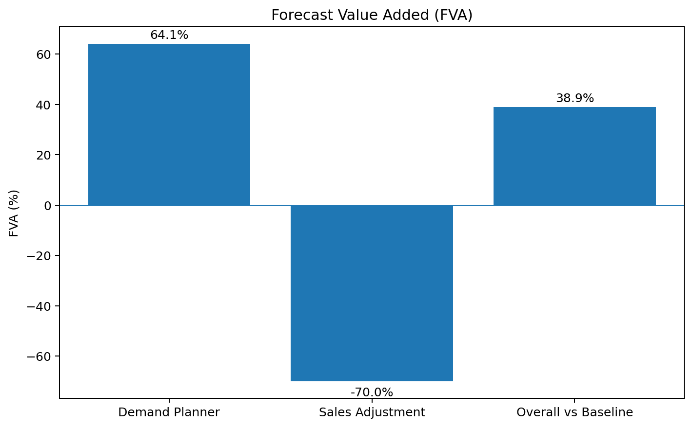

# 📊 Auditing Your Supply Chain with FVA & AVA

A practical supply-chain auditing project focused on two complementary questions:

- **Forecast Value Added (FVA):** Do the interventions made during the forecasting process improve forecast accuracy?
- **Allocation Value Added (AVA):** Do allocation decisions improve the way constrained inventory is distributed across customers, markets, channels, or locations?

The purpose of the project is not simply to calculate forecasting metrics. It is to demonstrate a **continuous-improvement approach to supply-chain decision making**: measure each intervention, identify whether it creates or destroys value, and redesign the process accordingly.

> 📓 **Full notebook:** [supply_chain_fva_ava_audit.ipynb](notebooks/supply_chain_fva_ava_audit.ipynb)

---

## 📑 Table of Contents

1. [Introduction](#introduction)
2. [What is Forecast Value Added (FVA)?](#what-is-forecast-value-added-fva)
3. [Why FVA Matters](#why-fva-matters)
4. [Forecast Accuracy Metric: MAPE](#forecast-accuracy-metric-mape)
5. [FVA Audit Results](#fva-audit-results)
6. [Interpreting the Forecasting Process](#interpreting-the-forecasting-process)
7. [FVA and S&OP Governance](#fva-and-sop-governance)
8. [Ensemble Forecasting](#ensemble-forecasting)
9. [What is Allocation Value Added (AVA)?](#what-is-allocation-value-added-ava)
10. [Why AVA Matters](#why-ava-matters)
11. [FVA and AVA as a Continuous-Improvement System](#fva-and-ava-as-a-continuous-improvement-system)
12. [Key Business Insights](#key-business-insights)
13. [Technologies](#technologies)
14. [Repository Structure](#repository-structure)
15. [Run Locally](#run-locally)
16. [Conclusion](#conclusion)

---

# Introduction

Supply-chain planning involves many decisions that are often treated as automatically valuable.

A statistical model may generate a forecast. A demand planner may override that forecast based on market knowledge. A sales team may then make another adjustment based on customer expectations. When supply is constrained, planners may also decide how available inventory should be allocated.

The important question is:

> **Did the intervention actually improve the decision?**

This project applies **Forecast Value Added (FVA)** and **Allocation Value Added (AVA)** as auditing frameworks.

Instead of assuming that every manual intervention improves the process, the approach measures whether each step creates measurable value.

---

# What is Forecast Value Added (FVA)?

**Forecast Value Added** measures the change in forecast performance produced by a particular step in the forecasting process.

A typical forecasting process might look like:

```text
Historical Demand
       ↓
Automatic / Statistical Forecast
       ↓
Demand Planner Adjustment
       ↓
Sales Team Adjustment
       ↓
Final Consensus Forecast
       ↓
Supply & Operations Planning
```

Each intervention can either:

- improve forecast accuracy,
- have little meaningful effect, or
- make the forecast worse.

FVA makes those effects visible.

A positive FVA indicates that the intervention improved accuracy relative to the previous forecasting stage.

A negative FVA indicates that the intervention reduced accuracy.

---

# Why FVA Matters

Organizations can spend significant time in forecast meetings and manual overrides without knowing whether those activities improve the forecast.

FVA helps answer questions such as:

- Does the statistical forecast provide a strong baseline?
- Does the demand planner consistently improve it?
- Do sales overrides add useful market intelligence?
- Which interventions introduce bias or noise?
- Which planning activities should be retained, redesigned, automated, or removed?
- Where should planners focus their time?

This makes FVA more than a forecasting metric. It is a **process-audit and governance tool**.

---

# Forecast Accuracy Metric: MAPE

The project evaluates forecast accuracy using **Mean Absolute Percentage Error (MAPE)**.

Conceptually:

```text
MAPE = average absolute percentage difference
       between actual demand and forecast demand
```

A **lower MAPE is better** because it means the forecast is closer to actual demand.

The forecasting stages can therefore be audited by comparing their MAPE values.

---

# FVA Audit Results

The notebook evaluates three stages:

1. Automatic Forecast
2. Demand Planner Adjustment
3. Sales Team Adjustment

## 📉 Forecast Accuracy Audit



| Forecast Stage | MAPE | Interpretation |
|---|---:|---|
| Automatic Forecast | **5.01%** | Baseline |
| Demand Planner Adjustment | **1.80%** | Strong improvement |
| Sales Team Adjustment | **3.06%** | Worse than planner forecast |

The Demand Planner reduces MAPE from **5.01% to 1.80%**.

The Sales Team adjustment then increases MAPE from **1.80% to 3.06%**.

Although the final Sales-adjusted forecast remains better than the original automatic forecast, it is worse than the Demand Planner forecast.

---

## 📈 Forecast Value Added



| Intervention | FVA | Interpretation |
|---|---:|---|
| Demand Planner | **+64.07%** | Strong positive value |
| Sales Adjustment vs Planner | **−70.0%** | Destroys part of the planner improvement |
| Overall vs Automatic Baseline | **+38.92%** | Final process still beats baseline |

The most important insight is that **human judgment is not automatically valuable or harmful**.

The Demand Planner adds substantial value.

The Sales adjustment, in this example, removes some of that value.

---

# Interpreting the Forecasting Process

The audit can be represented as:

```text
Automatic Forecast
MAPE = 5.01%
       │
       ▼
Demand Planner
MAPE = 1.80%
FVA = +64.07%
       │
       ▼
Sales Adjustment
MAPE = 3.06%
Incremental FVA = -70.0%
       │
       ▼
Final Forecast
Overall FVA vs baseline = +38.92%
```

This creates a much more useful management discussion than simply asking whether the final forecast was accurate.

The organization can investigate **which process step changed the result and whether that change was beneficial**.

---

# FVA and S&OP Governance

FVA can support stronger **Sales & Operations Planning (S&OP)** governance.

For example, instead of allowing unrestricted manual overrides, an organization can track override performance by:

- planner,
- sales representative,
- product,
- customer,
- market,
- forecast horizon,
- reason code.

Repeated positive FVA suggests that an intervention contains useful information not captured by the baseline model.

Repeated negative FVA suggests that the intervention should be investigated.

Possible responses include:

- requiring reason codes for overrides,
- setting override thresholds,
- reviewing systematic bias,
- improving the statistical model,
- training planners,
- limiting low-value adjustments,
- automating decisions that repeatedly fail to add value.

The goal is not to remove human judgment. It is to use human judgment **where evidence shows that it contributes value**.

---

# Ensemble Forecasting

A forecasting process does not always need to select one forecast and reject all others.

An **ensemble forecast** can combine multiple forecasting signals.

Potential inputs include:

```text
Statistical Forecast
        +
Demand Planner Knowledge
        +
Commercial / Sales Information
        ↓
Weighted / Consensus Forecast
```

However, FVA should still be used to test whether the combined approach improves accuracy.

An ensemble is useful only when the additional information improves the decision.

---

# What is Allocation Value Added (AVA)?

**Allocation Value Added (AVA)** applies a similar audit philosophy to inventory allocation.

When available supply is insufficient to satisfy every request, the organization must decide **where limited inventory should go**.

Allocation decisions may be based on:

- customer priority,
- contractual commitments,
- profitability,
- service-level targets,
- market importance,
- strategic accounts,
- inventory availability,
- demand urgency,
- channel priorities.

AVA asks whether the allocation decision creates better business outcomes than a baseline allocation rule.

---

# Why AVA Matters

Supply shortages make allocation decisions especially important.

A simple allocation rule may distribute inventory equally or proportionally. A planner may then override that rule based on business priorities.

AVA provides a framework for asking:

> **Did the override improve the allocation outcome?**

Possible allocation outcomes include:

- service level,
- fill rate,
- revenue protected,
- margin protected,
- strategic-customer service,
- shortage cost,
- lost sales,
- backorders.

This allows organizations to compare an **allocation baseline** with the **final allocation decision**.

A simplified audit structure is:

```text
Available Inventory
       ↓
Baseline Allocation Rule
       ↓
Planner / Business Override
       ↓
Final Allocation
       ↓
Measure Business Outcome
       ↓
Calculate Value Added
```

A positive AVA indicates that the allocation intervention improves the selected business objective.

A negative AVA indicates that the intervention makes the allocation outcome worse.

---

# FVA and AVA as a Continuous-Improvement System

FVA and AVA share the same management principle:

> **Do not assume that complexity adds value. Measure it.**

They can be viewed together as:

| Framework | Decision Being Audited | Example Baseline | Value Question |
|---|---|---|---|
| **FVA** | Forecast intervention | Statistical forecast | Did the adjustment improve forecast accuracy? |
| **AVA** | Inventory allocation intervention | Standard allocation rule | Did the adjustment improve the allocation outcome? |

The continuous-improvement cycle becomes:

```text
Establish Baseline
       ↓
Apply Intervention
       ↓
Measure Result
       ↓
Calculate Value Added
       ↓
Identify Positive / Negative Steps
       ↓
Investigate Root Cause
       ↓
Redesign Process
       ↓
Measure Again
```

This approach can reduce unnecessary process complexity and concentrate expert attention where it has the greatest impact.

---

# Key Business Insights

### 1. The baseline matters

Without a baseline, it is impossible to know whether an intervention created value.

### 2. The Demand Planner adds significant value

MAPE improves from **5.01% to 1.80%**, producing approximately **+64.07% FVA**.

### 3. The Sales adjustment should be investigated

The Sales-adjusted forecast has a MAPE of **3.06%**, worse than the Demand Planner forecast.

Its incremental FVA relative to the planner stage is approximately **−70%**.

### 4. The complete process still improves the automatic baseline

Despite the negative Sales intervention, the final forecast remains better than the original automatic forecast, with approximately **+38.92% overall FVA**.

### 5. FVA enables evidence-based S&OP governance

Overrides can be evaluated using historical performance rather than organizational hierarchy or intuition alone.

### 6. AVA extends the same philosophy to constrained supply

Allocation decisions should also be evaluated against measurable business outcomes.

### 7. Continuous improvement requires removing negative-value activity

A mature supply-chain process does not only add new tools and meetings. It also identifies activities that consistently fail to improve decisions.

---

# Technologies

- **Python**
- **Pandas**
- **NumPy**
- **Matplotlib**
- **Jupyter Notebook**
- Forecast accuracy metrics
- Forecast Value Added (FVA)
- Allocation Value Added (AVA)
- Supply-chain decision auditing
- S&OP governance concepts

---

# Repository Structure

```text
supply_chain_fva_ava_audit_project/
├── README.md
├── requirements.txt
├── .gitignore
├── notebooks/
│   └── supply_chain_fva_ava_audit.ipynb
└── images/
    ├── fva_mape_comparison.png
    └── fva_contribution.png
```

---

# Run Locally

```bash
git clone https://github.com/Ames0007/supply-chain-fva-ava-audit.git
cd supply-chain-fva-ava-audit

python -m venv .venv
source .venv/Scripts/activate

pip install -r requirements.txt
jupyter notebook notebooks/supply_chain_fva_ava_audit.ipynb
```

---

# Conclusion

FVA and AVA introduce a disciplined way to audit supply-chain decisions.

The FVA analysis demonstrates that the **Demand Planner creates substantial forecast value**, while the subsequent **Sales adjustment reduces part of that improvement**. Instead of treating this as a purely technical forecasting result, the organization can use it to improve S&OP governance and determine where human intervention is genuinely useful.

Allocation Value Added extends the same logic to constrained inventory decisions: establish a baseline, measure the effect of an intervention, and retain processes that demonstrably improve business outcomes.

The broader lesson is simple:

> **Continuous improvement requires measuring not only outcomes, but also the value created by every important decision step.**
